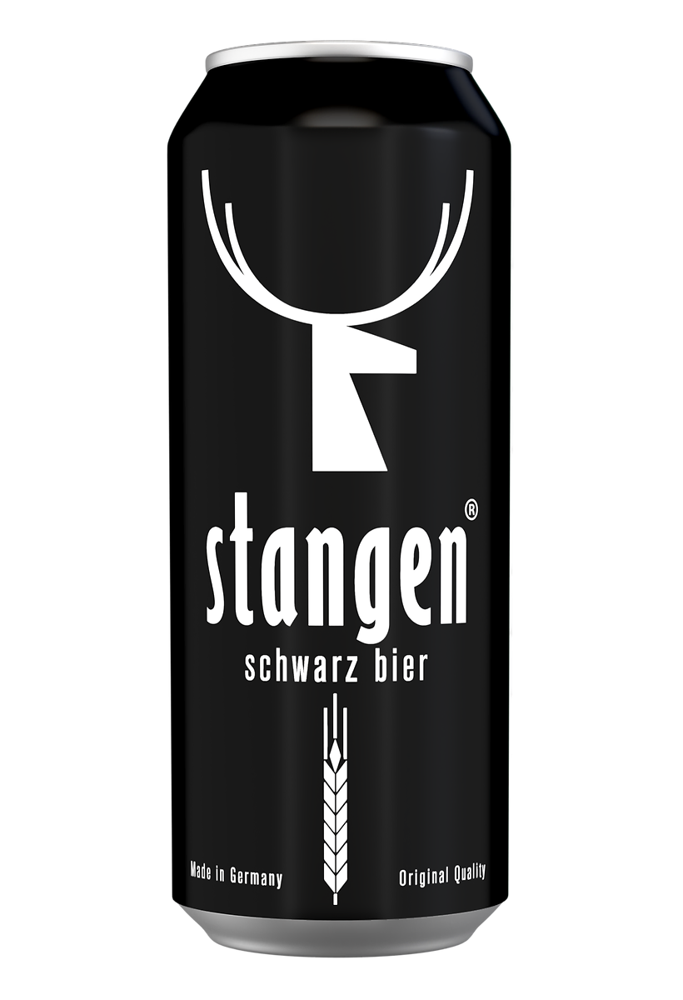

## Rating: 7/10

____

Stangen Schwarz Bier is an excellent representation of German brewing culture, a full-bodied dark lager celebrated for its rich flavors and enchanting dark-brown hue achieved from the roasted malts incorporated[^1]. Named after the traditional German serving method, 'Stangen', where beer is served in 200ml cylindrical glasses, Stangen Schwarz Bier is a tip of the hat to a time-honorable tradition.

This artful blend of craft and tradition is typically brewed with a combination of Munich malt, Pilsner malt, and rarely roasted malt that contributes to its distinctive dark shades, verging notably on the black side of the color spectrum. Hence the term 'Schwarz' which literally means black in German.

A classic German Schwarz Bier such as Stangen presents a balance of flavors that is truly noteworthy. The beer greets your senses with a mild aroma of lightly toasted bread, coffee, and a hint of chocolate. The taste complements the aroma, manifesting bittersweet chocolate and roasted malt flavors with a touch of caramel, followed by a clean, slightly hoppy finish. Despite its hearty outlook, one might be surprised by the relatively light to medium body texture of a Stangen Schwarz Bier, making it a smooth and highly drinkable beer, perfect for nearly all occasions.

An aspect that distinguishes Stangen Schwarz Bier from other dark lagers is its impressive blend of robust savor yet incredibly clean finish, an achievement only obtained through a carefully orchestrated lagering process. It exhibits the crisp characteristics of a lager while providing the rich flavors found in darker ales. A well-made Stangen Schwarz Bier walks this line admirably, delivering a layered and complex beer-drinking experience.

Another interesting aspect of Stangen Schwarz Bier is its versatility when it comes to food pairing. The toasty flavors of Stangen complement smoked sausages, hearty meats, and even Mexican dishes incredibly well. Its chocolatey undertones also give an unusual but splendid pairing with dessert selections, particularly those with dark chocolate and berries.

In conclusion, Stangen Schwarz Bier is more than just a beer. It’s a nod to traditional German brewing techniques while offering a unique, rich and flavorful experience. Whether you're a beer connoisseur seeking to delve deeper into the world of traditional German lagers, or a casual drinker looking for a well-rounded, tasteful beer, Stangen Schwarz Bier is definitely a brew that deserves your attention.
